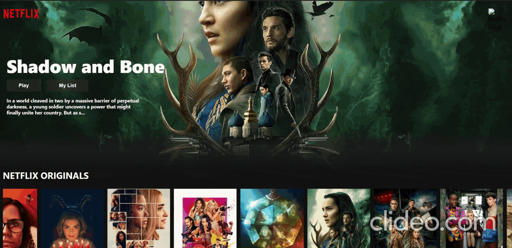
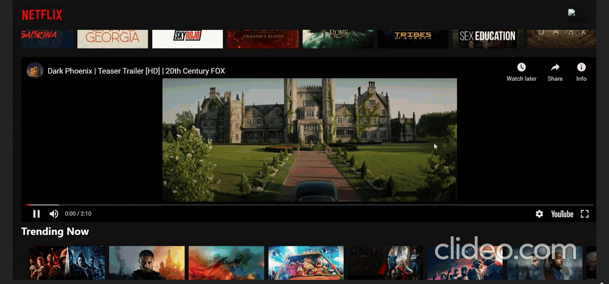
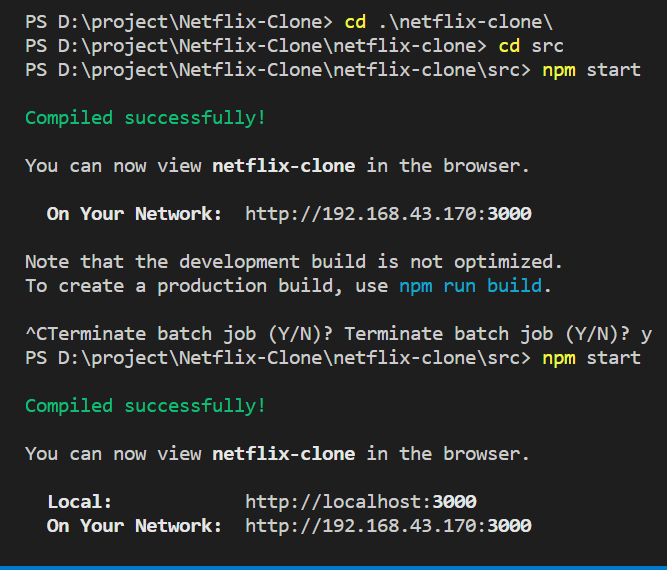
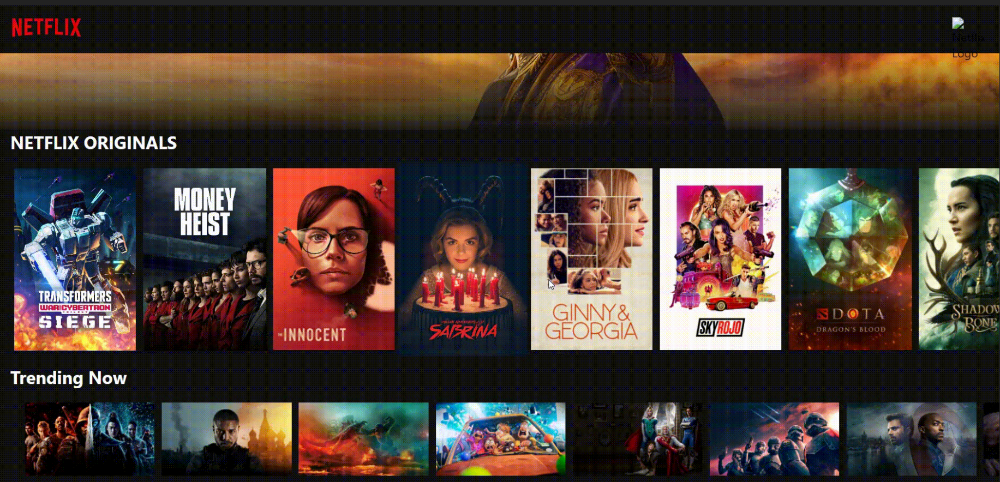

# Netflix Clone :

- A complete responsive Netflix clone , where you click on the poster of movies this will show the trailer of that movies from youtube using Imbd movie API .
  **_Netflix clone _** if I goona click a poster and play trailer you can go ahed and play a trailer .

## DEMO
  
- Here you can see i can scroll thruogh like `netflix` and move the mouse cursor for scrolling.
- `Play trailer` , there a lots of trailer you can see on clicking on the poster over here.

## Working:

- Actully i get all the Data from the Third Party API, So when you will `refresh` you see the top Poster and the information will automatic change .


## Steps:

- Get `TMDB API ` key
- Create `react app`
- Get all the `MOVIES`
- Build the `rows`
- Build the `Banner`
- Build the Nav `bar`
- Add trailer `popups`
- Setup Backend hosting on `Heroku`.
- Setup Frontend Hosting on `Netlify`.


### Running on local Machine:

> Make sure you have the lastest version of NodeJS engine installed on your local Machine.

- Clone the repository to your local by pasting the below command in the terminal.

```bash
    git clone https://github.com/abhishekrawe/Netflix-Clone
```

- Now, Open the folder in Visual Studio Code (or Text Editor). Then open the terminal and split that terminal into two parts as shown below:
  
- On 1st Terminal, Change the directory to **ui/whiteboard-collab**

```bash
    cd .\netflix-clone\ > cd src
```

- Then install the required dependencies to run the ReactJS web-application using following commands.

```bash
    npm install
```

- Now, it's time to start the React web-app using the following commands.

```bash
    npm start
```

- Now, your local server is started and running on port 3000.


